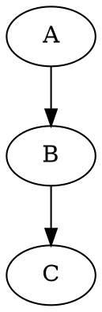

这个脚本是使用Go语言和`go/ast`包来解析指定目录中的Go语言源文件，提取函数调用关系并将其输出为Graphviz的DOT格式。Graphviz是一种用于绘制关系图的工具，而DOT语言是一种描述这些图的文本格式。通过将函数调用关系以DOT格式输出，我们可以很方便地使用Graphviz生成可视化的函数调用关系图。

### 脚本功能：
1. **解析Go源文件中的函数声明和函数调用**：
   - 该脚本使用`go/ast`包解析Go源文件的抽象语法树（AST），从中提取函数声明和函数调用。
   - 每当脚本发现一个函数声明时，它会检查该函数内部的函数调用，并将调用关系存储在`functionCalls`映射中。该映射以调用者函数为键，以被调用的函数列表为值。

2. **输出Graphviz的DOT格式**：
   - 脚本通过遍历函数调用映射，生成以DOT语言格式表示的调用关系图，输出到控制台。
   - 每个调用关系以 `"caller" -> "callee";` 形式输出，Graphviz可以根据该输出生成函数调用的可视化图形。

### 运行步骤：
1. 将该脚本保存为`.go`文件（例如`show_fun_refs_project.go`）。
2. 在终端中运行以下命令，其中`<path_to_directory>`是你要解析的Go源文件所在的目录路径：

   ```bash
   go run show_fun_refs_project.go <path_to_directory>
   ```

3. 脚本会解析指定目录中的所有Go文件，并输出函数调用关系图的DOT格式。

### 示例输出：
假设我们在某个目录中有以下两个简单的Go函数：

```go
func A() {
    B()
}

func B() {
    C()
}
```

执行脚本后，控制台会输出如下的DOT格式：



这个输出表示函数`A`调用了函数`B`，而函数`B`又调用了函数`C`。你可以将这个输出保存为`.dot`文件，并使用Graphviz工具将其渲染为可视化的调用关系图。

### 脚本的使用场景：
1. **代码审查**：帮助开发者快速了解项目中的函数调用关系。
2. **软件可视化**：生成函数调用图，有助于分析代码的结构和依赖关系。
3. **调试和优化**：通过查看函数调用链，发现可能的性能瓶颈或逻辑问题。

### 总结：
这个Go脚本利用`go/ast`包解析Go源代码，提取函数之间的调用关系，并生成Graphviz的DOT格式输出。它可以帮助开发者更好地理解代码结构，并通过可视化的方式展示复杂项目中的函数调用链。

