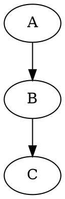

This script uses Go language and the `go/ast` package to parse Go source files in a specified directory, extract function call relationships, and output them in Graphviz DOT format. Graphviz is a tool for drawing relationship graphs, and DOT language is a text format for describing these graphs. By outputting function call relationships in DOT format, we can easily use Graphviz to generate visualized function call relationship graphs.

### Script Features:
1. **Parse function declarations and function calls in Go source files**:
   - The script uses the `go/ast` package to parse the abstract syntax tree (AST) of Go source files, extracting function declarations and function calls.
   - Whenever the script finds a function declaration, it checks for function calls within that function and stores the call relationships in the `functionCalls` map. This map uses the caller function as the key and the list of called functions as the value.

2. **Output in Graphviz DOT format**:
   - The script generates a call relationship graph in DOT language format by traversing the function call map and outputs it to the console.
   - Each call relationship is output in the form of `"caller" -> "callee";`, which Graphviz can use to generate a visualized graph of function calls.

### Running Steps:
1. Save the script as a `.go` file (e.g., `show_fun_refs_project.go`).
2. Run the following command in the terminal, where `<path_to_directory>` is the path to the directory containing the Go source files you want to parse:

   ```bash
   go run show_fun_refs_project.go <path_to_directory>
   ```

3. The script will parse all Go files in the specified directory and output the function call relationship graph in DOT format.

### Example Output:
Suppose we have the following two simple Go functions in a directory:

```go
func A() {
    B()
}

func B() {
    C()
}
```

After executing the script, the console will output the following DOT format:



This output indicates that function `A` calls function `B`, and function `B` calls function `C`. You can save this output as a `.dot` file and use Graphviz tools to render it into a visualized function call relationship graph.

### Use Cases for the Script:
1. **Code Review**: Helps developers quickly understand function call relationships in a project.
2. **Software Visualization**: Generates function call graphs, aiding in the analysis of code structure and dependencies.
3. **Debugging and Optimization**: By viewing the function call chain, potential performance bottlenecks or logical issues can be discovered.

### Summary:
This Go script uses the `go/ast` package to parse Go source code, extract function call relationships, and generate output in Graphviz DOT format. It can help developers better understand code structure and visualize function call chains in complex projects.
